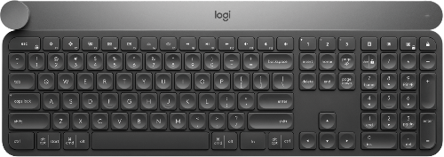

# Hackathon resources

## Craft SDK

This is the SDK to access the [Craft keyboard](https://www.logitech.com/en-ch/product/craft) and its input dial. This is a preview version of the SDK specially for the hackathon!

*   [Craft Crown SDK documentation](https://github.com/Logitech/logi_craft_sdk)
*   Logitech Options with Craft SDK support ([Win/OSX](https://support.logitech.com/en_us/software/options))

## Gaming SDK

These are the SDKs to control our Gaming devices.

*  [LGS (Logitech Gaming Software)](http://support.logitech.com/en_us/software/lgs)
*  [Logitech G HUB (Early Access)](https://support.logitech.com/en_us/software/lghub)
*  [LED Illumination SDK](https://www.logitechg.com/en-us/innovation/developer-lab.html)
*  [G-Key Macro SDK](https://www.logitechg.com/en-us/innovation/developer-lab.html)
*  [ARX Control SDK](https://www.logitechg.com/en-us/innovation/developer-lab.html)
*  [Game panel SDK](https://www.logitechg.com/en-us/innovation/developer-lab.html)
*  [Steering Wheel SDK](https://www.logitechg.com/en-us/innovation/developer-lab.html)

## Other resources

Other resources that can be helpful for challenges.

*  Input event capture docs (Win [here](https://msdn.microsoft.com/en-us/library/windows/desktop/ms644990(v=vs.85).aspx) and [there](https://msdn.microsoft.com/fr-fr/library/windows/desktop/ms645536(v=vs.85).aspx), [OSX](https://developer.apple.com/reference/coregraphics/quartz_event_services), [Linux](https://www.freedesktop.org/wiki/Software/libevdev/))
*  Input event injections docs (Win [here](https://msdn.microsoft.com/fr-fr/library/windows/desktop/ms646304(v=vs.85).aspx) and [there](https://msdn.microsoft.com/en-us/library/windows/desktop/ms646310(v=vs.85).aspx), OSX [here](https://developer.apple.com/documentation/coregraphics/1456564-cgeventcreatekeyboardevent) and [there](https://developer.apple.com/documentation/coregraphics/1456527-cgeventpost), [Linux](http://thiemonge.org/getting-started-with-uinput))
*  Input event capture example ([Win / C#](res/InputLogger.zip))

# Support

For support, you can either ping us on [#logitech](https://lauzhack2018.slack.com/messages/logitech/) in lauzhack2018 Slack channel or just come to our booth!

